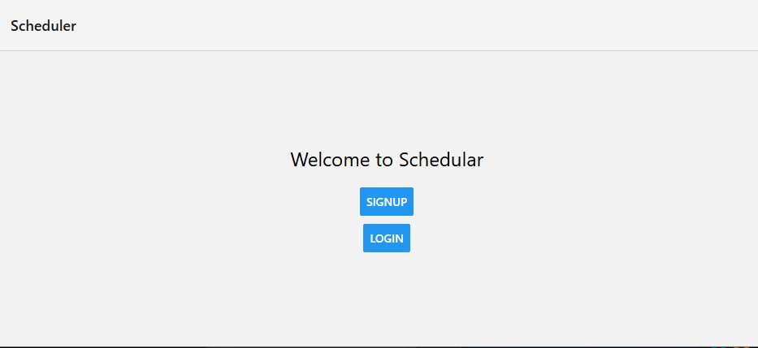
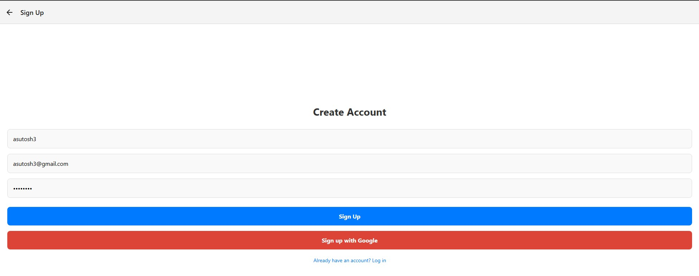

# Full-Stack Application (Spring Boot + React Native)

This project contains:
- Spring Boot backend
- React Native mobile frontend
- MySQL database

This documentation explains full setup, requirements, installation, and running both frontend and backend.

------------------------------------------------------------

# Project Structure

```
root/
 ├── backend/       # Spring Boot Application
 └── frontend/      # React Native App
```

------------------------------------------------------------

# Backend (Spring Boot)

## Requirements

- Java 17 or higher  
- Spring Boot 3.x  
- Maven 3.8+  
- MySQL 8.x  
- Git  
- MySQL username and password are required

------------------------------------------------------------

# MySQL Setup

1. Install MySQL Server
2. Create a database:

```sql
CREATE DATABASE schedular_db;
```

3. Configure database credentials in:

`src/main/resources/application.properties`

```
spring.datasource.url=jdbc:mysql://localhost:3306/schedular_db
spring.datasource.username=YOUR_USERNAME
spring.datasource.password=YOUR_PASSWORD
spring.jpa.hibernate.ddl-auto=update
spring.jpa.show-sql=true
```

------------------------------------------------------------

# Running Spring Boot Backend

Navigate to the backend directory:

```bash
cd backend
```

Run using Maven:

```bash
mvn spring-boot:run
```

Or run the jar:

```bash
java -jar target/backend-0.0.1-SNAPSHOT.jar
```

Backend runs at:

```
http://localhost:8081
```


## signup with postman


------------------------------------------------------------

# Frontend (React Native)

## Requirements

- Node.js 18+
- npm or yarn
- React Native CLI
- Android Studio (required for Android)
- Java JDK 17
- Git

------------------------------------------------------------

# Install React Native CLI

```bash
npm install -g react-native-cli
```

------------------------------------------------------------

# Install Dependencies

Go to the frontend folder:

```bash
cd frontend
npm install
```

or

```bash
yarn install
```

------------------------------------------------------------

# Configure API URL (React Native)

Update your API URL in your JavaScript config file:

```javascript
export const API_URL = "http://10.0.2.2:8082";   
```

If using a real device, replace with your IP:

```javascript
export const API_URL = "http://YOUR_LOCAL_IP:8082";
```

Find IP address:

```bash
ipconfig
```

# running react native in my pc






------------------------------------------------------------

# Running React Native App

Start Metro:

```bash
npm start
```

Run on Android:

```bash
npm run android
```

or:

```bash
npx react-native run-android
```

------------------------------------------------------------

# Testing Backend API

Using curl:

```bash
curl http://localhost:8080/api/users
```

Using JS in React Native:

```javascript
fetch(`${API_URL}/api/users`)
  .then(res => res.json())
  .then(data => console.log(data))
  .catch(err => console.error(err));
```


------------------------------------------------------------

# Environment Variables (Optional)

Example `.env` file:

```
DB_USER=root
DB_PASSWORD=yourpassword
API_BASE=http://localhost:8080
```

Do not commit `.env` to GitHub.

## Data saved to mysql

1. normal signup data


2. signup with oauth google data


------------------------------------------------------------


# End of Documentation
